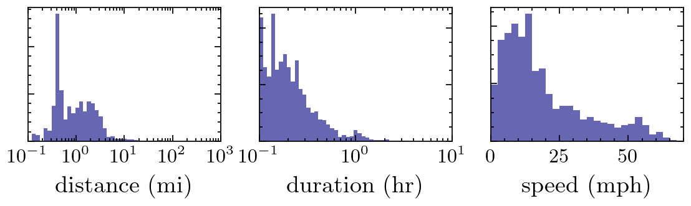

# Roadmaps
<br />
<p align="center">
  <a href="https://github.com/sephwalker321/Roadmaps">
  </a>
  <h3 align="center">road and region maps</h3>
</p>


<!-- TABLE OF CONTENTS -->
<details open="open">
  <summary>Table of Contents</summary>
  <ol>
    <li>
      <a href="#about-the-project">About The Module</a>
      <ul>
        <li><a href="#built-with">Built With</a></li>
      </ul>
    </li>
    <li>
      <a href="#getting-started">Getting Started</a>
      <ul>
        <li><a href="#prerequisites">Prerequisites and Installation</a></li>
      </ul>
    </li>
    <li><a href="#usage">Usage</a></li>
    <li><a href="#examples">Examples</a></li>
    <li><a href="#license">License</a></li>
    <li><a href="#contact">Contact</a></li>
  </ol>
</details>


<!-- ABOUT THE PROJECT -->
## About The Project

<p align="center">
  <a href="https://github.com/sephwalker321/Roadmaps">
  </a>
</p>

Python module to plot roads transversed using Google maps timeline data.

### Built With

The module was constructed using the following libraries,
* [Python](https://www.python.org/)

* [OpenStreetMap](https://www.openstreetmap.org/#map=6/54.910/-3.432)

and the following resources,

* [GoogleMaps](https://timeline.google.com/)

* [Boundary lines of the UK ceremonial counties](https://osdatahub.os.uk/downloads/open/BoundaryLine)

* [Boundary lines of the states of USA](https://www.census.gov/geographies/mapping-files/time-series/geo/carto-boundary-file.html)

* [Boundary lines of the Canadian provinces](http://tapiquen-sig.jimdo.com)

* [Boundary lines of the UN recognised countries](https://hub.arcgis.com/datasets/esri::world-countries-generalized)

<!-- GETTING STARTED -->
## Getting Started

To get a local copy up and running follow these simple example steps.

### Prerequisites and Installation

This is an example of how to list things you need to use the software and how to install them.

1. Clone the repo,
   ```
   git clone https://github.com/sephwalker321/Roadmaps.git
   ```

2. Running the install script,
  Linux:
  ```
  ./install_Linux.sh
  ```
  Windows:
  ```
  install_Windows.bat
  ```

3. Source the virtual environment,
  Linux:
  ```
  source venv/bin/activate
  ```
  Windows:
  ```
  venv\Scripts\activate
  ```

Alternatively see *requirements.txt* and install manually. 
<!-- USAGE EXAMPLES -->
## Usage
Jupyter Notebooks are provided for the collation of data and plotting.

1. Notebooks/RoadMaps.ipynb generate road maps and summary statistics.

2. Notebooks/RegionMaps.ipynb generate highlighted region maps and markers for visited cities.

To run place Google Timeline .klm files in data/roads_raw/ and update .yaml files in data/places_raw/ with true and false values.

## Examples
Road maps can be generated by added a list of .klm files into data/roads_raw/ and navigating through Notebooks/RoadMaps.ipynb notebook,

<p align="center">

</p>

A set of summary histograms can also be produced,

<p align="center">

</p>

<p align="center">

</p>

Odometer,

<p align="center">

</p>

Visted regions and cities maps can be generated by updating the .yaml in data/places_raw/ and navigating through Notebook/RegionMaps.ipynb 

<p align="center">


</p>


<!-- LICENSE -->
## License

Distributed under the MIT License. See `LICENSE` for more information.


<!-- CONTACT -->
## Contact

For any issues or questions contact Joseph Walker

Project Link: [https://github.com/sephwalker321/Roadmaps.git](https://github.com/sephwalker321/Roadmaps.git)